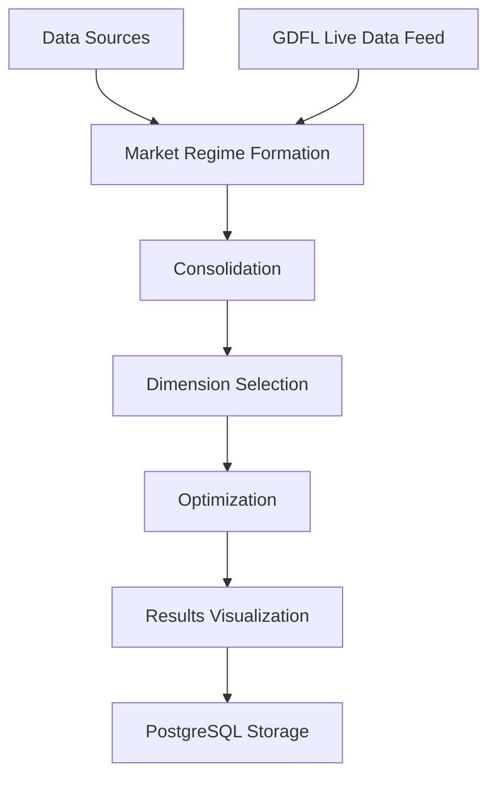
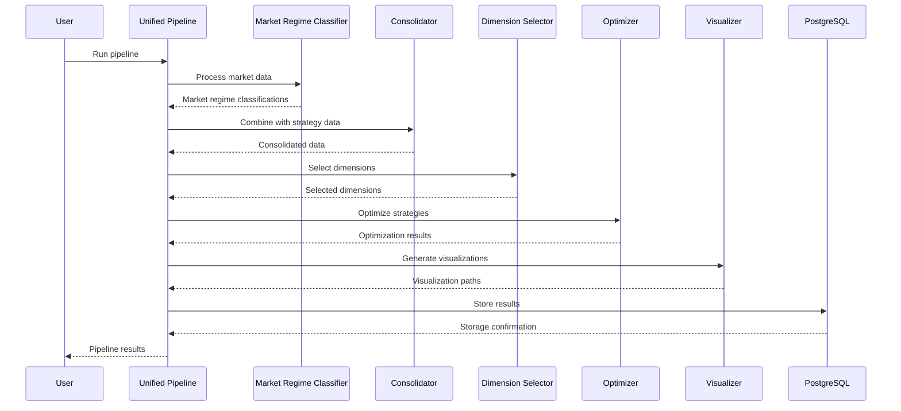

# Enhanced Market Regime Optimizer Pipeline Structure

## Overview

This document provides a comprehensive overview of the Enhanced Market Regime Optimizer pipeline structure, showing how all components fit together to form a complete system for market regime identification, strategy consolidation, and optimization.

## Pipeline Architecture

The Enhanced Market Regime Optimizer pipeline follows a modular architecture with clearly defined components that work together to process market data, identify market regimes, consolidate strategy data, and optimize trading strategies.



### Data Flow

1. **Data Ingestion**: Market data is ingested from historical sources or the GDFL live data feed.
2. **Market Regime Formation**: The market regime classifier analyzes the data to identify the current market regime.
3. **Consolidation**: The market regime data is combined with strategy performance data.
4. **Dimension Selection**: The most relevant dimensions for optimization are identified.
5. **Optimization**: Trading strategies are optimized based on the selected dimensions.
6. **Results Visualization**: The optimization results are visualized for analysis.
7. **Data Storage**: All data is stored in a PostgreSQL database for future reference.

## Component Interactions

### 1. Data Sources → Market Regime Formation

Market data from historical sources or the GDFL live data feed is processed by the market regime formation component, which calculates various indicators and identifies the current market regime.

**Key Files**:
- `unified_market_regime_pipeline.py`: Main entry point for the pipeline
- `src/market_regime_classifier.py`: Market regime classifier implementation
- `utils/feature_engineering/`: Feature engineering components

**Documentation**:
- [Unified Market Regime Pipeline](Unified_Market_Regime_Pipeline.md)
- [Market Regime Formation](Market_Regime_Formation.md)
- [GDFL Live Data Feed](GDFL_Live_Data_Feed.md)

### 2. Market Regime Formation → Consolidation

The market regime classifications are passed to the consolidation component, which combines them with strategy performance data.

**Key Files**:
- `core/consolidation.py`: Consolidation implementation
- `data/input/TV_Zone_Files/`: TradingView zone files
- `data/input/Python_Multi_Zone_Files/`: Python multi-zone files

**Documentation**:
- [Consolidation](Consolidation.md)

### 3. Consolidation → Dimension Selection

The consolidated data is passed to the dimension selection component, which identifies the most relevant dimensions for optimization.

**Key Files**:
- `core/dimension_selection.py`: Dimension selection implementation

**Documentation**:
- [Dimension Selection](Dimension_Selection.md)

### 4. Dimension Selection → Optimization

The selected dimensions are passed to the optimization component, which optimizes trading strategies based on these dimensions.

**Key Files**:
- `core/optimization.py`: Optimization implementation
- `core/algorithms/`: Optimization algorithms

**Documentation**:
- [Optimization](Optimization.md)

### 5. Optimization → Results Visualization

The optimization results are passed to the results visualization component, which generates various visualizations for analysis.

**Key Files**:
- `core/results_visualization.py`: Results visualization implementation

**Documentation**:
- [Results Visualization](Results_Visualization.md)

### 6. Results Visualization → PostgreSQL Storage

The results are stored in a PostgreSQL database for future reference.

**Key Files**:
- `core/integration/postgresql_integration.py`: PostgreSQL integration implementation

**Documentation**:
- [PostgreSQL Integration](PostgreSQL_Integration.md)

## Execution Flow

The execution flow of the Enhanced Market Regime Optimizer pipeline is orchestrated by the `unified_market_regime_pipeline.py` script, which serves as the main entry point for the system.



## Configuration

The Enhanced Market Regime Optimizer pipeline is highly configurable, with configuration options for each component. The configuration is typically provided through INI files or Python dictionaries.

### Main Configuration Files

- `config/pipeline_config.ini`: Main pipeline configuration
- `config/local_config.ini`: Local configuration overrides
- `config/test_config.ini`: Configuration for testing
- `config/database/database_config.ini`: PostgreSQL database configuration

### Example Configuration

```ini
[PIPELINE]
output_dir = output
use_multi_timeframe = true
use_time_of_day_adjustments = true

[COMPONENT_WEIGHTS]
greek_sentiment = 0.20
trending_oi_pa = 0.30
iv_skew = 0.20
ema_indicators = 0.15
vwap_indicators = 0.15

[TIMEFRAME_WEIGHTS]
5m = 0.20
15m = 0.30
1h = 0.30
1d = 0.20

[TIME_OF_DAY_WEIGHTS]
opening = 1.2
morning = 1.0
lunch = 0.8
afternoon = 1.0
closing = 1.2

[DIMENSION_SELECTION]
method = correlation
top_dimensions = 5
correlation_threshold = 0.1
importance_threshold = 0.1

[OPTIMIZATION]
algorithm = differential_evolution
population_size = 50
max_iterations = 100
target = PnL
direction = maximize
```

## Directory Structure

The Enhanced Market Regime Optimizer pipeline follows a well-organized directory structure:

```
enhanced-market-regime-optimizer/
├── unified_market_regime_pipeline.py  # Main entry point
├── batch_files/                      # Batch files for running the pipeline
├── config/                           # Configuration files
│   ├── config.py
│   ├── local_config.ini
│   ├── pipeline_config.ini
│   ├── test_config.ini
│   └── database/
│       └── database_config.ini
├── core/                             # Core pipeline components
│   ├── consolidation.py
│   ├── dimension_selection.py
│   ├── optimization.py
│   ├── results_visualization.py
│   ├── algorithms/                   # Optimization algorithms
│   └── integration/
│       └── postgresql_integration.py
├── data/                             # Data directory
│   ├── input/
│   │   ├── TV_Zone_Files/
│   │   └── Python_Multi_Zone_Files/
│   └── market_data/
├── docs/                             # Documentation
│   ├── Unified_Market_Regime_Pipeline.md
│   ├── Market_Regime_Formation.md
│   ├── Consolidation.md
│   ├── Dimension_Selection.md
│   ├── Results_Visualization.md
│   ├── PostgreSQL_Integration.md
│   ├── GDFL_Live_Data_Feed.md
│   └── Pipeline_Structure.md
├── output/                           # Output directory
├── src/                              # Source code
│   ├── market_regime_classifier.py
│   └── minute_regime_classifier.py
├── utils/                            # Utility functions
│   ├── feature_engineering/          # Feature engineering components
│   │   ├── greek_sentiment/
│   │   ├── trending_oi_pa/
│   │   ├── iv_skew/
│   │   ├── ema_indicators/
│   │   └── vwap_indicators/
│   └── dynamic_weight_adjustment/
└── tests/                            # Test files
```

## Running the Pipeline

The Enhanced Market Regime Optimizer pipeline can be run in several ways:

### 1. Using the Unified Pipeline Script

```bash
python unified_market_regime_pipeline.py --config config/pipeline_config.ini
```

### 2. Using Batch Files

```bash
./batch_files/run_prod_market_regime.bat
```

### 3. Using the Python API

```python
from unified_market_regime_pipeline import MarketRegimePipeline

# Initialize pipeline
pipeline = MarketRegimePipeline(config_file='config/pipeline_config.ini')

# Run pipeline
result = pipeline.run_pipeline(
    data_file='data/market_data/nifty_options_data.csv',
    output_file='output/nifty_market_regimes.csv',
    dte=5,
    timeframe='5m'
)
```

## Integration Points

The Enhanced Market Regime Optimizer pipeline provides several integration points for external systems:

### 1. GDFL Live Data Feed

The pipeline can integrate with the GDFL live data feed to receive real-time market data.

**Documentation**: [GDFL Live Data Feed](GDFL_Live_Data_Feed.md)

### 2. PostgreSQL Database

The pipeline can store and retrieve data from a PostgreSQL database.

**Documentation**: [PostgreSQL Integration](PostgreSQL_Integration.md)

### 3. External Strategy Systems

The pipeline can integrate with external strategy systems through the consolidation component.

**Documentation**: [Consolidation](Consolidation.md)

## Extending the Pipeline

The Enhanced Market Regime Optimizer pipeline is designed to be extensible, allowing for the addition of new components and functionality:

### 1. Adding New Feature Engineering Components

New feature engineering components can be added to the `utils/feature_engineering/` directory and integrated with the market regime classifier.

### 2. Adding New Optimization Algorithms

New optimization algorithms can be added to the `core/algorithms/` directory and integrated with the optimization component.

### 3. Adding New Visualization Types

New visualization types can be added to the results visualization component.

### 4. Adding New Data Sources

New data sources can be integrated with the pipeline by implementing appropriate data adapters.

## Conclusion

The Enhanced Market Regime Optimizer pipeline provides a comprehensive solution for market regime identification, strategy consolidation, and optimization. By understanding the pipeline structure and component interactions, users can effectively leverage the system to improve their trading strategies.

For detailed information on each component, refer to the component-specific documentation:

- [Unified Market Regime Pipeline](Unified_Market_Regime_Pipeline.md)
- [Market Regime Formation](Market_Regime_Formation.md)
- [Consolidation](Consolidation.md)
- [Dimension Selection](Dimension_Selection.md)
- [Results Visualization](Results_Visualization.md)
- [PostgreSQL Integration](PostgreSQL_Integration.md)
- [GDFL Live Data Feed](GDFL_Live_Data_Feed.md)