# Enhanced Market Regime Optimizer Documentation Plan

## Overview

This document outlines the comprehensive plan for enhancing the documentation of the Enhanced Market Regime Optimizer pipeline. The goal is to provide clear, detailed, and well-structured documentation that explains how the entire system works, with special emphasis on the unified pipeline as the main entry point.

## Documentation Structure

```mermaid
graph TD
    A[Enhanced Market Regime Optimizer Pipeline] --> B[Unified Market Regime Pipeline]
    A --> C[Market Regime Formation]
    A --> D[Consolidation]
    A --> E[Dimension Selection]
    A --> F[Results Visualization]
    A --> G[PostgreSQL Integration]
    A --> H[GDFL Live Data Feed]
    
    B --> B1[Components]
    B --> B2[Configuration]
    B --> B3[Usage Guide]
    
    C --> C1[Indicators]
    C --> C2[Classification]
    C --> C3[Confidence Levels]
    
    D --> D1[Strategy Processing]
    D --> D2[Regime Assignment]
    
    E --> E1[Dimension Identification]
    E --> E2[Correlation Analysis]
    E --> E3[Combined Selections]
    
    F --> F1[Visualization Types]
    F --> F2[Output Formats]
    
    G --> G1[Database Schema]
    G --> G2[Data Storage]
    
    H --> H1[Integration Architecture]
    H --> H2[Real-time Processing]
```

## Documentation Files

### 1. Enhanced Market Regime Optimizer Pipeline (enhanced_market_regime_optimizer_pipeline.md)

**Purpose**: Provide an overview of the entire pipeline and serve as the main entry point for documentation.

**Content**:
- Introduction to the Enhanced Market Regime Optimizer
- Pipeline overview and flow
- Component relationships and interactions
- Directory structure with component locations
- References to detailed documentation for each component
- Emphasis on unified_market_regime_pipeline.py as the main entry point
- Quick start guide

### 2. Unified Market Regime Pipeline (Unified_Market_Regime_Pipeline.md)

**Purpose**: Provide detailed documentation for the unified_market_regime_pipeline.py, which serves as the main entry point for the system.

**Content**:
- Overview of the unified pipeline
- Detailed explanation of all pipeline components
- Complete configuration options reference
  - Component weights
  - Multi-timeframe settings
  - Time-of-day adjustments
- Market regime indicators selection guide
- Dimensional optimization configuration (DTE, zone, market regime)
- Market regime confidence level explanation
- Step-by-step usage guide with examples
- Integration with consolidator and optimizer
- Troubleshooting guide
- Performance considerations

### 3. Market Regime Formation (Market_Regime_Formation.md)

**Purpose**: Provide a comprehensive overview of the market regime formation process.

**Content**:
- Overview of market regime formation
- Detailed explanation of the 18 market regimes
- Indicator contributions:
  - Greek sentiment analysis
  - Trending OI with PA analysis
  - IV skew analysis
  - EMA indicators
  - VWAP indicators
- Directional and volatility components
- Regime classification methodology
- Dynamic weight adjustments
- Confidence scoring
- Multi-timeframe analysis
- Time-of-day adjustments
- Output format and interpretation

### 4. Consolidation (Consolidation.md)

**Purpose**: Document the consolidation process that combines strategy data with market regime data.

**Content**:
- Overview of the consolidation process
- Input data sources:
  - Strategy data (TradingView zone files, Python multi-zone files)
  - Market regime data
- Processing steps:
  - Data merging
  - Data transformation
  - Market regime assignment
- Output format with detailed column descriptions
- Configuration options
- Integration with the unified pipeline
- Troubleshooting guide
- Performance considerations

### 5. Dimension Selection (Dimension_Selection.md)

**Purpose**: Document the dimension selection process that identifies the most relevant dimensions for optimization.

**Content**:
- Overview of dimension selection
- Available selection methods:
  - Correlation-based selection
  - Feature importance-based selection
  - All dimensions selection
- Dimension identification process
- Correlation analysis methodology
- Feature importance calculation
- Combined selection creation
- Configuration options
- Integration with the unified pipeline and optimization
- Troubleshooting guide
- Performance considerations

### 6. Results Visualization (Results_Visualization.md)

**Purpose**: Document the results visualization capabilities of the system.

**Content**:
- Overview of visualization capabilities
- Types of visualizations:
  - Strategy performance visualizations
  - Market regime visualizations
  - Dimension selection visualizations
  - Optimization results visualizations
  - Combined performance visualizations
- Interactive dashboard generation
- Configuration options
- Output formats and interpretation
- Integration with the unified pipeline
- Troubleshooting guide
- Performance considerations

### 7. PostgreSQL Integration (PostgreSQL_Integration.md)

**Purpose**: Document the PostgreSQL integration for data storage and retrieval.

**Content**:
- Overview of PostgreSQL integration
- Database schema and table structures
- Connection management and pooling
- Data storage capabilities:
  - Market data storage
  - Options data storage
  - Market regime storage
  - 1-minute rolling market regime storage
  - Optimization results storage
- Query capabilities
- Performance optimizations
- Configuration options
- Integration with the unified pipeline
- Troubleshooting guide
- Performance considerations

### 8. GDFL Live Data Feed Integration (GDFL_Live_Data_Feed.md)

**Purpose**: Document the conceptual design and implementation of the GDFL live data feed integration.

**Content**:
- Overview of GDFL integration purpose
- Credential management (GDFL_cred.txt)
- Integration architecture
- Data flow from GDFL to market regime classifier
- Real-time market regime generation
- CSV output file generation matching historical data outputs
- Configuration options
- Integration with the unified pipeline
- Troubleshooting guide
- Performance considerations

## Documentation Format

Each documentation file will follow this consistent structure:

1. **Overview**: Brief description of the component and its role in the pipeline
2. **Methodology**: Detailed explanation of how the component works
3. **Implementation Details**: Technical details of the implementation
4. **Configuration Options**: Available configuration parameters with examples
5. **Integration with Other Components**: How this component interacts with others
6. **Example Usage**: Code examples showing how to use the component
7. **Output Format**: Description of the output format with examples
8. **Troubleshooting**: Common issues and solutions
9. **Performance Considerations**: Tips for optimizing performance

## Implementation Approach

The implementation will follow this approach:

1. First, update the enhanced_market_regime_optimizer_pipeline.md file to establish the overall structure and flow
2. Then create the individual documentation files in this order:
   a. Unified_Market_Regime_Pipeline.md
   b. Market_Regime_Formation.md
   c. Consolidation.md
   d. Dimension_Selection.md
   e. Results_Visualization.md
   f. PostgreSQL_Integration.md
   g. GDFL_Live_Data_Feed.md
3. For each documentation file:
   a. Analyze the corresponding implementation file
   b. Extract key concepts, parameters, and functionality
   c. Create the documentation following the template structure
   d. Include relevant code examples
   e. Add diagrams where helpful for understanding
   f. Ensure all references to other components are accurate

## Timeline and Priorities

1. **Day 1**: Update enhanced_market_regime_optimizer_pipeline.md and create Unified_Market_Regime_Pipeline.md
2. **Day 2**: Create Market_Regime_Formation.md and Consolidation.md
3. **Day 3**: Create Dimension_Selection.md and Results_Visualization.md
4. **Day 4**: Create PostgreSQL_Integration.md and GDFL_Live_Data_Feed.md
5. **Day 5**: Review and finalize all documentation, ensure consistency and accuracy